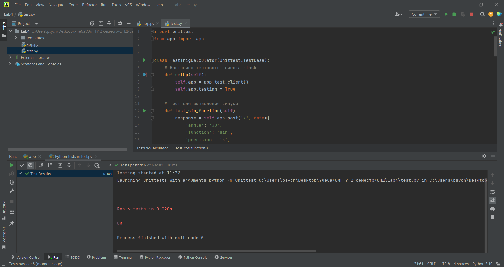

# ЛР4 по ОПД, 2 семестр
Выполнила Корноухова Маргарита, ПИН-232.
Вариант 1. Вычисление тригонометрических функций с заданной точностью, выбор градусов или радиан. Написать unit тесты для своих вариантов из лабораторной работы №3.

